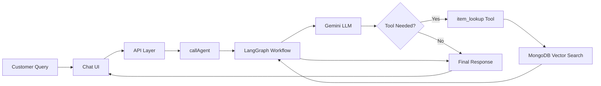
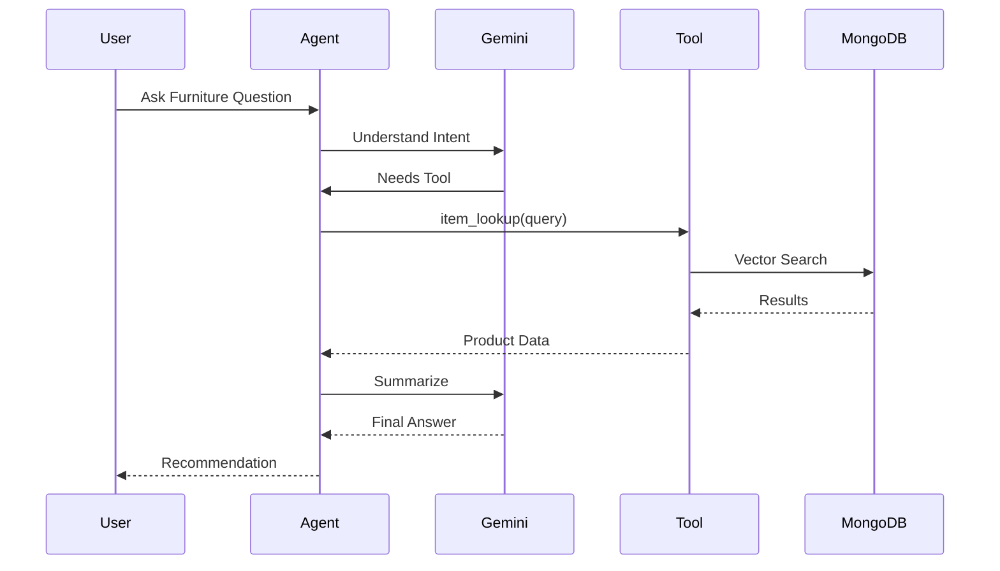
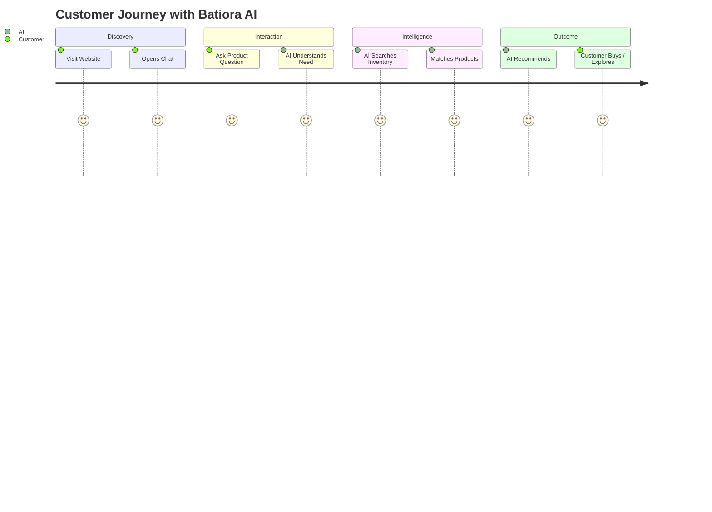
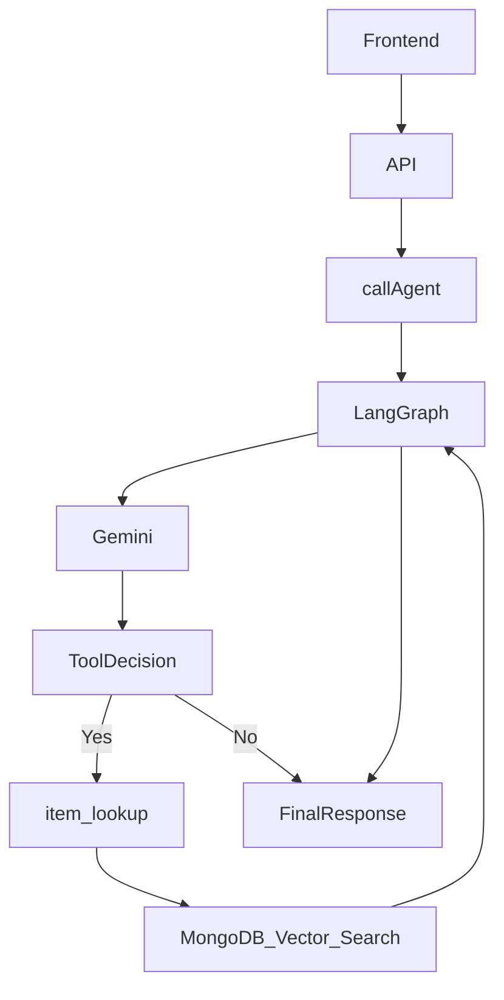

# 🤖 Batiora AI Chat Agent

An AI-powered conversational assistant that helps customers discover products using  
**LLM reasoning + Tool usage + Vector Search**

Built with:

- Gemini LLM
- LangGraph Agent Workflow
- MongoDB Atlas Vector Search

---

## 🚀 What This Agent Does

When a customer asks:

> "Show me a wooden sofa"

The AI:

1. Understands the intent  
2. Decides whether inventory lookup is needed  
3. Uses a custom tool (`item_lookup`)  
4. Searches MongoDB using:
   - Vector similarity
   - Text fallback  
5. Returns intelligent recommendations  

---

## 🧠 Architecture Overview



---

## ⚙️ Tech Stack

| Layer | Technology |
|------|------------|
| LLM | Gemini |
| Agent Framework | LangGraph |
| Embeddings | Gemini Embeddings |
| Database | MongoDB Atlas |
| Search | Vector + Text |
| Tooling | LangChain Tools |
| State | MongoDB Checkpoint |

---

## 🔄 Agent Tool Loop



---

## 🧩 Core Components

### 1. callAgent()

Main orchestrator that:

- Maintains conversation state
- Runs LangGraph workflow
- Handles retries
- Produces final response

---

### 2. LangGraph Workflow

Handles:

- AI reasoning
- Tool execution
- State persistence

Flow:

```
Agent → Tool → Agent → Final Answer
```

---

### 3. item_lookup Tool

Searches Batiora inventory using:

- Vector similarity search
- Regex fallback search

Returns:

```json
{
  "results": [],
  "searchType": "vector | text",
  "count": 10
}
```

---

### 4. MongoDB Vector Search

Used for:

- Semantic product discovery
- Natural language queries
- Similarity matching

---

## 🧍 Customer Journey



---

## 📁 Project Flow



---

## 🛠 Setup

### 1. Install dependencies

```bash
npm install
```

---

### 2. Add environment variables

Create `.env`

```
GOOGLE_API_KEY=your_key
GOOGLE_CHAT_MODEL=gemini-2.5-flash
GOOGLE_EMBEDDING_MODEL=gemini-embedding-001
```

---

### 3. Run

```bash
npm run dev
```

---

## 🔮 Future Enhancements

- Multi-tool support  
- Order placement agent  
- Pricing intelligence  
- Conversational checkout  

---

## 🏷 Use Cases

- E-commerce chat assistant  
- Inventory discovery  
- Product recommendation engine  
- AI sales assistant  

---

## 🏁 Outcome

This project enables:

- Natural language product search  
- Intelligent inventory lookup  
- AI-powered recommendations  
- Tool-based reasoning  

---
